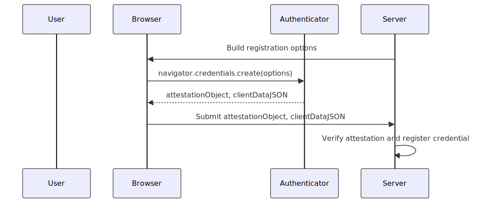
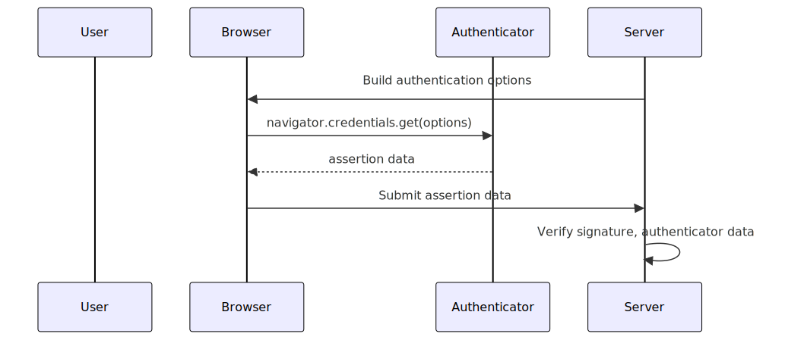
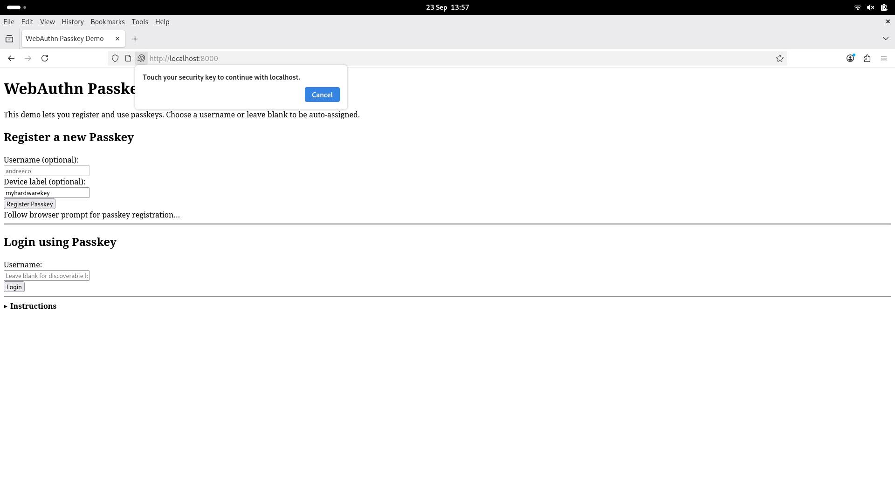
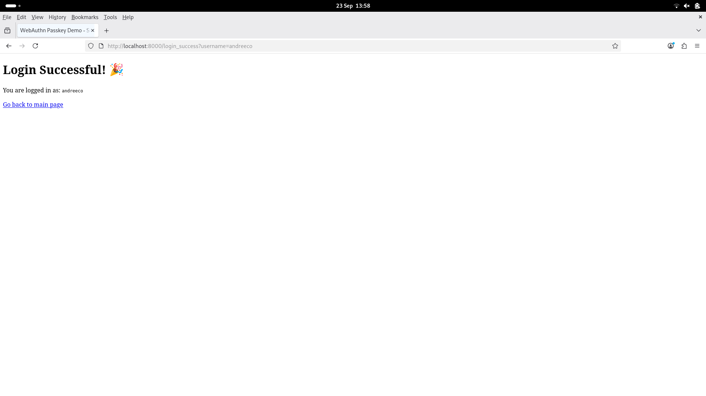
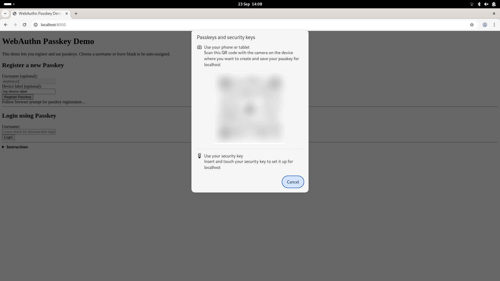

# WebAuthn.jl

```@meta
CurrentModule = WebAuthn
```

[WebAuthn.jl](https://github.com/andreeco/WebAuthn.jl) brings passkey and FIDO2/WebAuthn authentication to Julia web servers.  
It provides end-to-end functions for registration and login, CBOR/COSE key parsing, challenge signing, signature verification, and PEM export.

---

## Features

- CBOR/COSE key parsing (P-256, RSA, Ed25519)
- Base64url encode/decode & random challenge generator
- Registration and authentication options utilities
- Secure signature and challenge verification
- PEM export of public keys

---

## Getting Started

1. **Install this package:**
   ```
   ] add WebAuthn
   ```
2. **Import into your Julia session:**
   ```julia
   using WebAuthn
   ```
3. **For Demo Server Example below:**  
   ```
   ] add HTTP, Sockets, JSON3, WebAuthn, Random, CBOR
   ```

---

## How WebAuthn Works

WebAuthn enables **passwordless**, phishing-resistant authentication using public-key cryptography.  
A passkey (credential) is generated and stored securely on the user device; **private keys never leave** the device.

---

### Registration Workflow



1. **Server generates options:**  
   [`registration_options`](@ref) — builds challenge and metadata for browser.

2. **Client creates credential:**  
   Browser and authenticator generate a new passkey on the device.

3. **Authenticator returns attestation:**  
   Browser returns `attestationObject` and `clientDataJSON` to your server.

4. **Server verifies registration:**  
   - Parse: [`parse_attestation_object`](@ref), [`parse_clientdata_json`](@ref)
   - Check challenge: [`verify_challenge`](@ref)
   - Extract public key: [`extract_credential_public_key`](@ref), [`cose_key_parse`](@ref)
   - (Optional) Validate attestation: [`verify_attestation_object`](@ref)  
   - Store credential ID & public key for future logins.

---

### Authentication Workflow



1. **Server generates assertion options:**  
   [`authentication_options`](@ref)

2. **Client signs with passkey:**  
   Browser prompts user; authenticator signs challenge.

3. **Authenticator returns assertion:**  
   Server receives: authenticator data, clientDataJSON, signature.

4. **Server verifies signature:**  
   - Parse: [`parse_assertion`](@ref), [`parse_clientdata_json`](@ref)
   - Verify challenge: [`verify_challenge`](@ref)
   - Signature check: [`verify_webauthn_signature`](@ref)  
   - (Optional) Enforce signCount, user presence, user verification

---

### Core Functions by Flow

| Phase          | Step              | WebAuthn.jl Functions                                                    |
|----------------|-------------------|--------------------------------------------------------------------------|
| Registration   | Build options     | [`registration_options`](@ref)                                           |
|                | Parse & verify    | [`parse_attestation_object`](@ref), [`parse_clientdata_json`](@ref),[`verify_challenge`](@ref), [`extract_credential_public_key`](@ref), [`cose_key_parse`](@ref), [`verify_attestation_object`](@ref) |
| Authentication | Build options     | [`authentication_options`](@ref)                                         |
|                | Parse & verify    | [`parse_assertion`](@ref), [`parse_clientdata_json`](@ref), [`verify_challenge`](@ref), [`verify_webauthn_signature`](@ref)                         |

_See also:_ [`cose_key_to_pem`](@ref) for PEM export/interoperation.

---

## Tips

- All crypto uses [OpenSSL_jll](https://github.com/JuliaBinaryWrappers/OpenSSL_jll.jl) and [Sodium.jl](https://github.com/Gnimuc/Sodium.jl).
- Always verify the **challenge** and client **origin** in every response.
- Check **signCount** to stop replay or clone attacks.
- For user presence/verification, check flags in authenticator data (see FIDO2 spec).

---

## Demo Server Example

Below is a **reference implementation** of a simple web server.
It serves HTML/JS assets, builds and verifies WebAuthn flows, and manages user 
passkeys in memory.

**Demo screenshots:**





## How to Test WebAuthn with a Security Key or Phone

1. **With hardware key:**  
   Insert device, use when prompted.

2. **With smartphone (virtual security key):**  
   - Enable Bluetooth on computer and phone and connect them
   - Visit demo site in Chrome; choose "Use phone" when prompted
   - Scan QR code on screen and follow prompts on your phone

---

## Full Example Server

After installing the dependencies, you can copy-paste this code.

```julia
using HTTP, Sockets, JSON3, WebAuthn, Random, CBOR

USERS = Dict{String,Dict{Symbol,Any}}()
CREDENTIALS = Dict{String,Dict{Symbol,Any}}()
router = HTTP.Router()

function serve_login_success(req)
    params = HTTP.queryparams(req)
    username = get(params, "username", "")
    html = replace(WebAuthn.asset("login_success.html"),
        "{{USERNAME}}" => HTTP.escapehtml(username))
    return HTTP.Response(200, ["Content-Type" => "text/html"], html)
end
HTTP.register!(router, "GET", "/login_success", serve_login_success)

function serve_index(req)
    HTTP.Response(200, ["Content-Type" => "text/html"],
        WebAuthn.asset("index.html"))
end
HTTP.register!(router, "GET", "/", serve_index)

function serve_webauthn_register_js(req)
    HTTP.Response(200, ["Content-Type" => "application/javascript"],
        WebAuthn.asset("webauthn_register.js"))
end
HTTP.register!(router, "GET", "/webauthn_register.js",
    serve_webauthn_register_js)

function serve_webauthn_login_js(req)
    HTTP.Response(200, ["Content-Type" => "application/javascript"],
        WebAuthn.asset("webauthn_login.js"))
end
HTTP.register!(router, "GET", "/webauthn_login.js", serve_webauthn_login_js)

# Registration options endpoint (browser calls before registration)
function serve_regoptions(req)
    q = HTTP.queryparams(req)
    username = get(q, "username", "")
    if isempty(username)
        charset = vcat('A':'Z', 'a':'z', '0':'9')
        username = join(rand(charset, 8))
    end
    opts = WebAuthn.registration_options(
        "localhost", "Passkey Demo", username, username, username;
        exclude_ids=[]
    )
    USERS[username] = Dict(:challenge => opts["challenge"])
    return HTTP.Response(200, ["Content-Type" => "application/json"],
        JSON3.write(merge(opts, Dict("username" => username))))
end
HTTP.register!(router, "GET", "/webauthn/options/register", serve_regoptions)

# Registration finalize endpoint
function serve_regfinish(req)
    payload = JSON3.read(String(req.body))
    username = get(payload, "username", "")
    if isempty(username)
        return HTTP.Response(400, ["Content-Type" => "text/plain"],
            "Missing username")
    end
    chal = get(USERS[username], :challenge, nothing)
    if chal === nothing
        return HTTP.Response(400, ["Content-Type" => "text/plain"],
            "No challenge for username.")
    end
    if !WebAuthn.verify_challenge(
        payload["response"]["clientDataJSON"], chal)
        return HTTP.Response(400, ["Content-Type" => "text/plain"],
            "Challenge fail")
    end
    attobj = WebAuthn.parse_attestation_object(
        payload["response"]["attestationObject"])
    pkbytes = WebAuthn.extract_credential_public_key(attobj["authData"])
    cred_id = payload["id"]
    CREDENTIALS[cred_id] = Dict(
        :public_key_cose => WebAuthn.base64urlencode(pkbytes),
        :sign_count => 0,
        :username => username
    )
    return HTTP.Response(200, ["Content-Type" => "application/json"],
        JSON3.write(Dict("ok" => true, "username" => username)))
end
HTTP.register!(router, "POST", "/webauthn/register", serve_regfinish)

# Login options endpoint (now always records challenge per credential)
function serve_loginoptions(req)
    q = HTTP.queryparams(req)
    username = get(q, "username", "")
    allow_ids = String[]
    if !isempty(username)
        allow_ids = [cid for (cid, c) in CREDENTIALS if get(
            c, :username, "") == username]
        if isempty(allow_ids)
            allow_ids = String[]
        end
    else
        # usernameless/discoverable: allow ALL credential IDs
        allow_ids = collect(keys(CREDENTIALS))
    end
    opts = WebAuthn.authentication_options("localhost",
        allow_credential_ids=allow_ids)
    # Save this challenge to every involved credential:
    for cid in allow_ids
        CREDENTIALS[cid][:challenge] = opts["challenge"]
    end
    return HTTP.Response(200, ["Content-Type" => "application/json"],
        JSON3.write(merge(opts, Dict("username" => username))))
end
HTTP.register!(router, "GET", "/webauthn/options/login", serve_loginoptions)

# Login finalize endpoint (challenge fetched from credential now)
function serve_loginfinish(req)
    payload = JSON3.read(String(req.body))
    credid = payload["id"]
    if !haskey(CREDENTIALS, credid)
        return HTTP.Response(403, ["Content-Type" => "text/plain"],
            "Unknown credential")
    end
    cred = CREDENTIALS[credid]
    chal = get(cred, :challenge, nothing)
    if chal === nothing
        return HTTP.Response(400, ["Content-Type" => "text/plain"],
            "No challenge issued for this credential")
    end
    if !WebAuthn.verify_challenge(payload["response"]["clientDataJSON"], chal)
        return HTTP.Response(400, ["Content-Type" => "text/plain"],
            "Challenge fail")
    end
    pubkey = WebAuthn.cose_key_parse(
        CBOR.decode(WebAuthn.base64urldecode(cred[:public_key_cose])))
    ok = WebAuthn.verify_webauthn_signature(pubkey,
        WebAuthn.base64urldecode(payload["response"]["authenticatorData"]),
        WebAuthn.base64urldecode(payload["response"]["clientDataJSON"]),
        WebAuthn.base64urldecode(payload["response"]["signature"]))
    username = get(cred, :username, "")
    if ok
        return HTTP.Response(200, ["Content-Type" => "application/json"],
            JSON3.write(Dict("ok" => true, "username" => username,
                "redirect" => "/login_success?username=$username"))
        )
    else
        return HTTP.Response(403, ["Content-Type" => "text/plain"],
            "Bad signature")
    end
end
HTTP.register!(router, "POST", "/webauthn/login", serve_loginfinish)

srv = HTTP.serve!(router, Sockets.localhost, 8000)
```

---

## Documentation

Full docs are auto-published at [WebAuthn.jl](https://andreeco.github.io/WebAuthn.jl/dev).
---

## Contributions

Questions, issues, and PRs welcome!  
See [WebAuthn.jl on GitHub](https://github.com/andreeco/WebAuthn.jl/issues).

---

## License

Licensed under the MIT License. See 
[LICENSE](https://github.com/andreeco/WebAuthn.jl/blob/main/LICENSE) for details.

---
